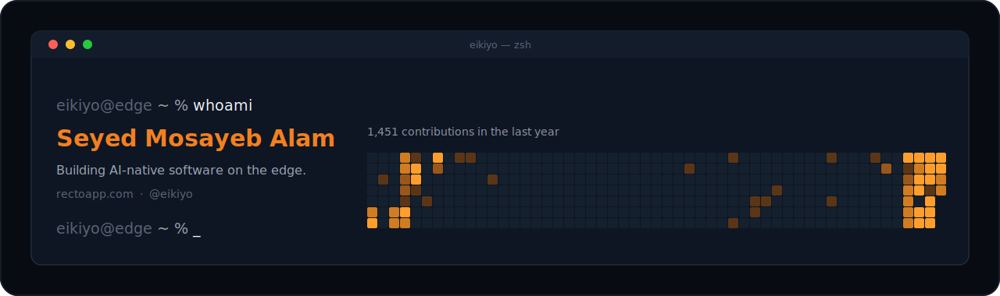

  

  <a href="https://rectoapp.com">Website</a>
  &nbsp;·&nbsp;
  <a href="https://github.com/eikiyo/recto">Open source</a>
  &nbsp;·&nbsp;
  <a href="#-reach-me">Contact</a>

---

I build small, sharp products and ship them fast — most of them running entirely on Cloudflare's edge. I care about **clarity over cleverness, depth over breadth, and code that earns its place.** New code is the last resort; the best feature is the one I didn't have to build.

 

### ◆ Featured — Recto

> **Orphan-page rescue & automatic internal-link insertion for WordPress and Webflow.**

Most sites quietly bury their best pages — published, then never linked to again. Recto finds those orphan pages and weaves them back into your site's internal-link structure: the highest-ROI, most-ignored fix in technical SEO. Runs entirely on Cloudflare Workers, self-hostable, MIT-licensed. *Clone → one command → running locally.*

&nbsp;&nbsp;**→ [github.com/eikiyo/recto](https://github.com/eikiyo/recto)** &nbsp;·&nbsp; **[rectoapp.com](https://rectoapp.com)**

 

### ◆ How I build

Edge-first, AI-native, reuse-first. I lean on a small, sharp stack and let AI coding agents do the typing while I keep the judgment.

 

### ◆ What I'm about

- **Ship over polish, then polish what shipped.** Real products in front of real users beat perfect plans.
- **Fail closed, never silent.** On any uncertainty, produce nothing and surface why — invisible failures are the expensive ones.
- **One thing, fully.** Five features at 100% beat twenty at 50%.

 

### ◆ Reach me

- **Web** — [rectoapp.com](https://rectoapp.com)
- **GitHub** — [@eikiyo](https://github.com/eikiyo)
<!-- Add when ready:
- **Email** — you@example.com
- **X / LinkedIn** — your-handle
-->

Clarity is the feature.

